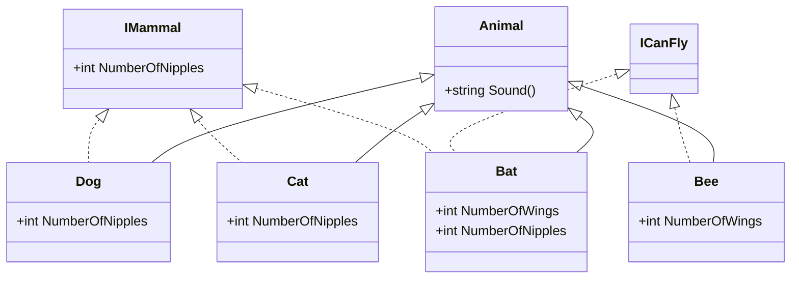

```mermaid
classDiagram
    class Animal {
        +string Sound()
    }
    class Dog {
        +int NumberOfNipples
    }
    class Cat {
        +int NumberOfNipples
    }
    class Bat {
        +int NumberOfWings
        +int NumberOfNipples
    }
    class Bee {
        +int NumberOfWings
    }
    class IMammal {
        +int NumberOfNipples
    }
    Animal <|-- Dog
    IMammal <|.. Dog
    Animal <|-- Cat
    IMammal <|.. Cat
    Animal <|-- Bat
    ICanFly <|.. Bat
    IMammal <|.. Bat
    Animal <|-- Bee
    ICanFly <|.. Bee
```